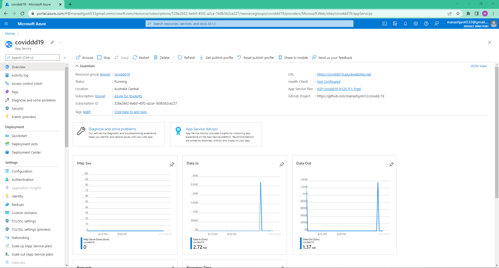
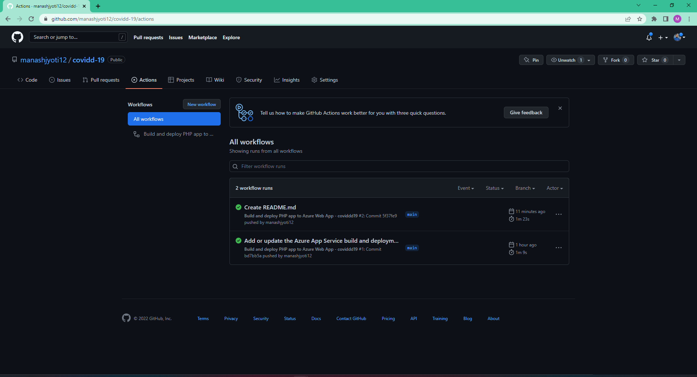

# Azure Chatbot: covid-19

## Problem Statement:

With the spread of COVID-19 across the world, there is a sense of panic and uncertainty amongst the public. People are not sure what measures to take to safeguard themselves and their family and have many questions. Moreover, rumors, myths and misinformation about COVID-19 have spread as quickly as the virus itself. There is a need for health organizations to automate as many responses to these inquiries as possible to free up human resources to deal with more complex problems in the fight against this pandemic.

## Project Description:

In our project we have used many azure services for creating an chatbot for educational purpose which gives information about Covid. This chatbot is build using QnA maker.  QnA Maker is a cloud-based Natural Language Processing (NLP) service that allows you to create a natural conversational layer over your data. It is used to find the most appropriate answer for any input from your custom knowledge base (KB) of information. With the help of Azure QnA maker we can prebuilt or upload the questionaries for our chatbot. Here, we've used Azure Bot Service to add chatbot to our google site. Hence with the help of above technologies we have integrated our chatbot to the google site which we have created.
This website is developed to get the live updates of covid cases in India. It is build using Bootstrap, PHP and to get the realtime update of covid cases it uses COVID-19 API (https://api.covid19india.org/data.json). And deployed on azure cloud platform using azure web apps service.

## Primary Azure Technology

Azure Bot Service, Azure Cognitive Services, Azure static Web apps

## Project Link: https://coviddd19.azurewebsites.net/  OR  https://covide19-trackker.herokuapp.com/

##  GitHub repository: https://github.com/manashjyoti12/covidd-19

## Project Demo Video: https://drive.google.com/file/d/1eoubDNe58q66iKT94bSKU8vbcTeJECII/view?usp=sharing

## Screenshots:

### website screenshot:

### Deployment using Web App screenshot:

### Github build succesful screenshot:

